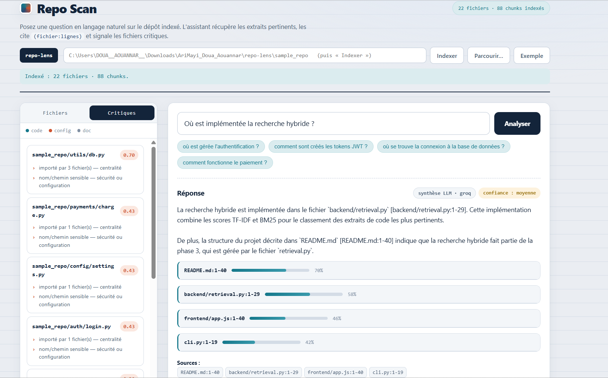

# Repo Scan – Assistant conversationnel d'analyse de repository

Repo Scan est un assistant conversationnel permettant d'analyser automatiquement un repository logiciel et de répondre à des questions en langage naturel sur son contenu.

L'objectif est d'aider les développeurs à comprendre rapidement un projet existant, identifier les principaux modules, retrouver l'emplacement d'une fonctionnalité, détecter les fichiers critiques et faciliter la prise en main d'un nouveau code source.



---

# Fonctionnalités

* Analyse automatique d'un repository logiciel.
* Exploration de l'architecture du projet.
* Recherche des fonctionnalités dans le code source.
* Identification des principaux modules.
* Détection des fichiers critiques.
* Réponses en langage naturel.
* Citations des fichiers et des lignes utilisées pour générer les réponses.
* Interface Web simple développée avec FastAPI.

---

# Structure du projet

```text
repo-Scan/
│
├── backend/
│   ├── api.py
│   ├── assistant.py
│   ├── ingest.py
│   ├── chunking.py
│   ├── indexing.py
│   ├── retrieval.py
│   ├── critical.py
│   └── llm.py
│
├── frontend/
│   ├── index.html
│   ├── styles.css
│   └── app.js
│
├── sample_repo/
├── cli.py
├── requirements.txt
├── .env.example
└── README.md
```

---

# Technologies utilisées

* Python
* FastAPI
* HTML
* CSS
* JavaScript
* TF-IDF
* BM25
* LLM (Groq)

---

# Architecture générale

Le fonctionnement de l'assistant repose sur plusieurs étapes :

1. Analyse du repository.
2. Découpage des fichiers en segments adaptés.
3. Indexation du contenu.
4. Recherche des passages les plus pertinents.
5. Génération d'une réponse en langage naturel.
6. Affichage des sources utilisées.

Cette architecture permet de produire des réponses argumentées tout en indiquant précisément les fichiers consultés.

---

# Installation

Cloner le projet :

```bash
git clone https://github.com/AouannarDoua/repo-Scan
cd repo-Scan
```

Installer les dépendances :

```bash
pip install -r requirements.txt
```

---

# Configuration

Créer un fichier `.env` puis ajouter une clé API si vous souhaitez utiliser un modèle de langage.

Exemple :

```env
GROQ_API_KEY=YOUR_API_KEY
```
---

# Lancer l'application

## API FastAPI

```bash
uvicorn backend.api:app --reload
```

Puis ouvrir :

```
http://127.0.0.1:8000
```

Documentation Swagger :

```
http://127.0.0.1:8000/docs
```

---

## Utilisation en ligne de commande

Poser une question :

```bash
python cli.py sample_repo --ask "Où est gérée l'authentification ?"
```

Afficher les fichiers critiques :

```bash
python cli.py sample_repo --critical
```

Afficher l'arborescence :

```bash
python cli.py sample_repo --tree
```

---

# Exemple de questions

* Où est gérée l'authentification ?
* Quels sont les principaux modules ?
* Quelle est l'architecture du projet ?
* Où est implémentée l'API REST ?
* Quels sont les fichiers critiques ?
* Comment fonctionne l'indexation ?
* Comment commencer la lecture du projet ?

---

# Perspectives d'amélioration

* Utilisation d'embeddings spécialisés pour le code.
* Intégration d'une base vectorielle.
* Analyse basée sur l'AST pour une meilleure compréhension du code.
* Prise en charge de nouveaux langages de programmation.
* Amélioration de l'évaluation de la pertinence des réponses.

---

# Auteur

Projet développé par **Doua AOUANNAR** dans le cadre d'un prototype d'assistant conversationnel pour l'analyse de repositories logiciels.
